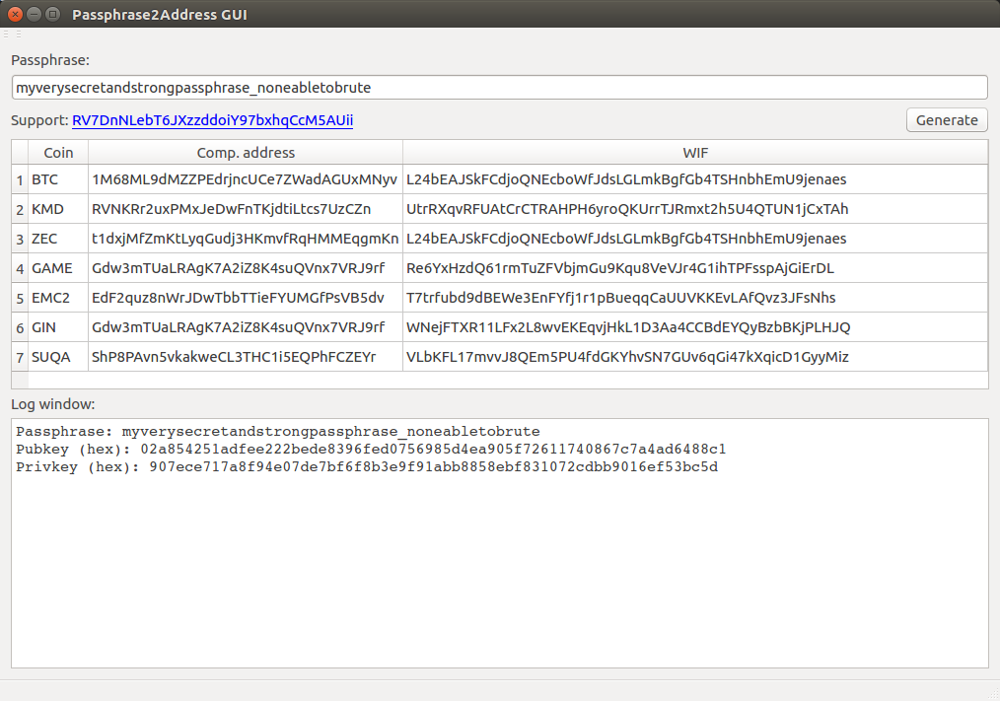

## Passphrase2Address GUI

This is simple Qt app for generate addresses and WIFs for various coins from Agama passphrase. It's used [libbitcoin](https://github.com/libbitcoin/libbitcoin) for address generation and required following deps:

- Qt5
- Boost
- secp256k1
- gmp
- libbitcoin

### How to build?

- Linux

```
sudo apt install build-essential libtool autotools-dev automake pkg-config
sudo apt install git
sudo apt install libboost-dev
sudo apt install libboost-chrono-dev libboost-system-dev libboost-thread-dev libboost-regex-dev libboost-program-options-dev libboost-log-dev libboost-locale-dev libboost-iostreams-dev libboost-filesystem-dev libboost-date-time-dev libboost-test-dev
sudo apt install libgmp-dev
sudo apt install libqt5gui5 libqt5core5a libqt5dbus5 qttools5-dev qttools5-dev-tools libprotobuf-dev protobuf-compiler
sudo apt install qt5-default

git clone https://github.com/DeckerSU/address_gen
cd address_gen
./build_deps.sh
qmake
make
```

### Run

```
./address_gen
```

